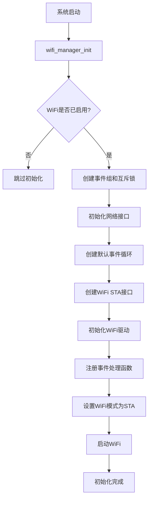
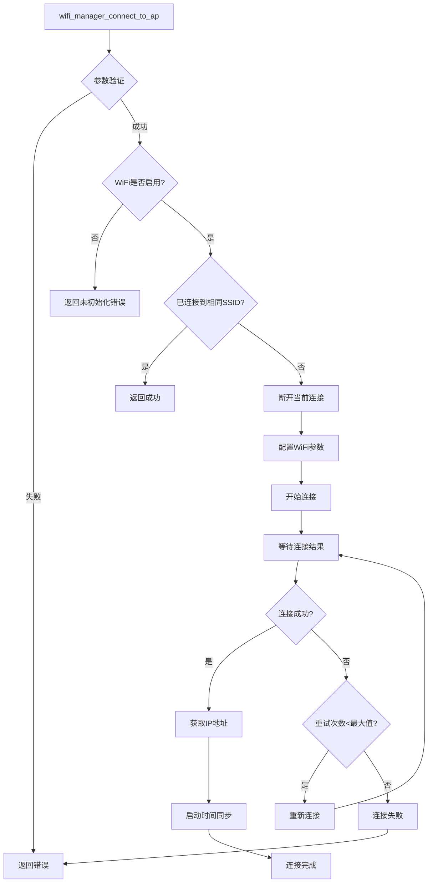
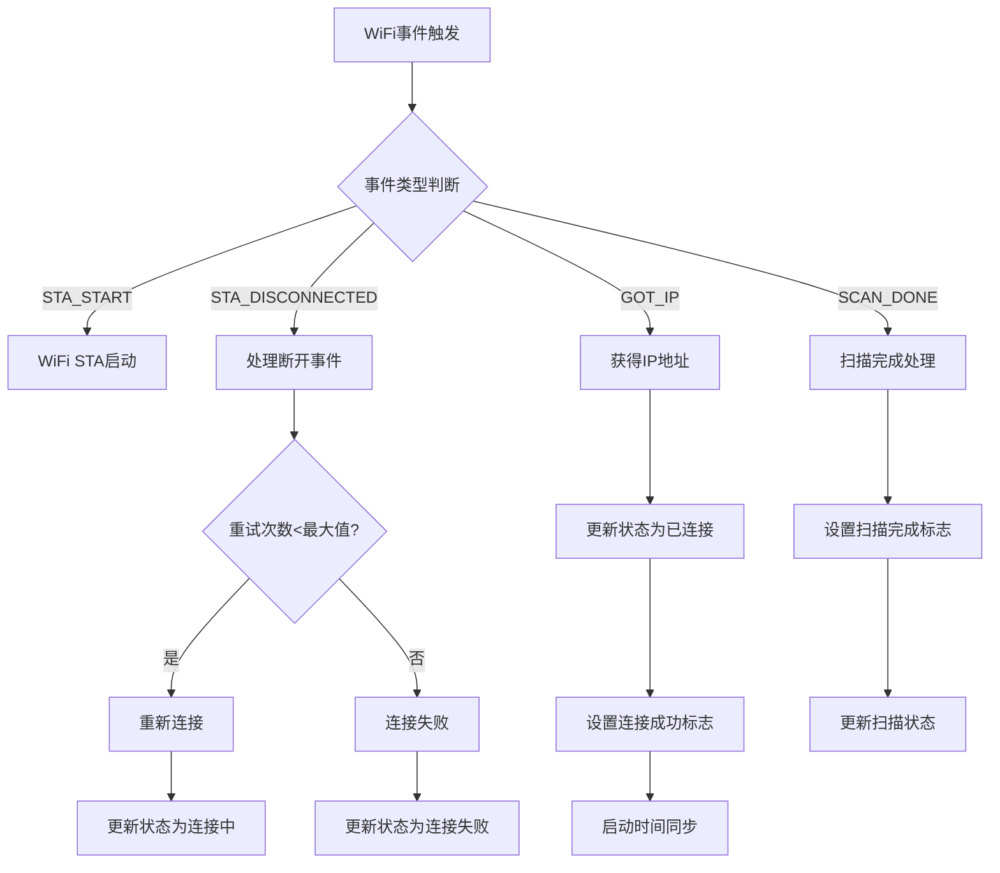
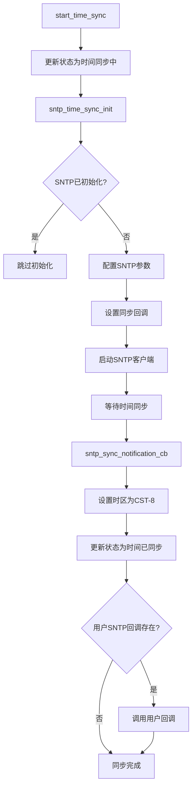
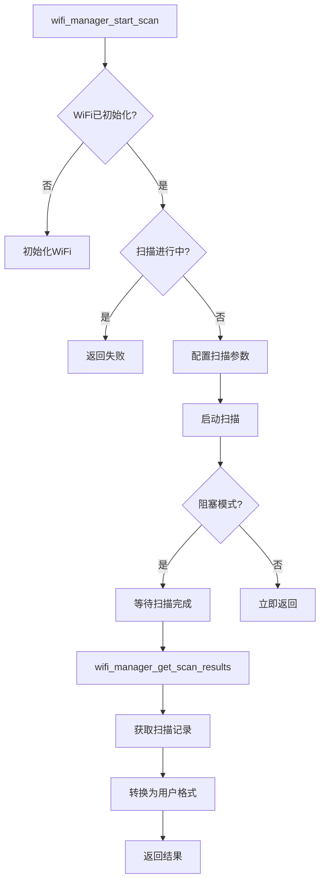
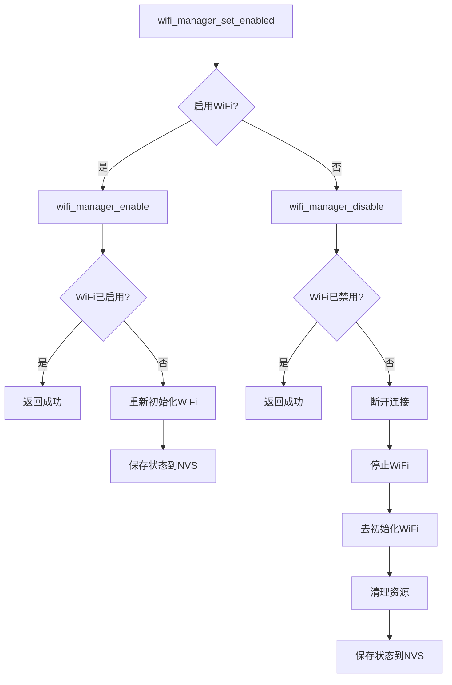
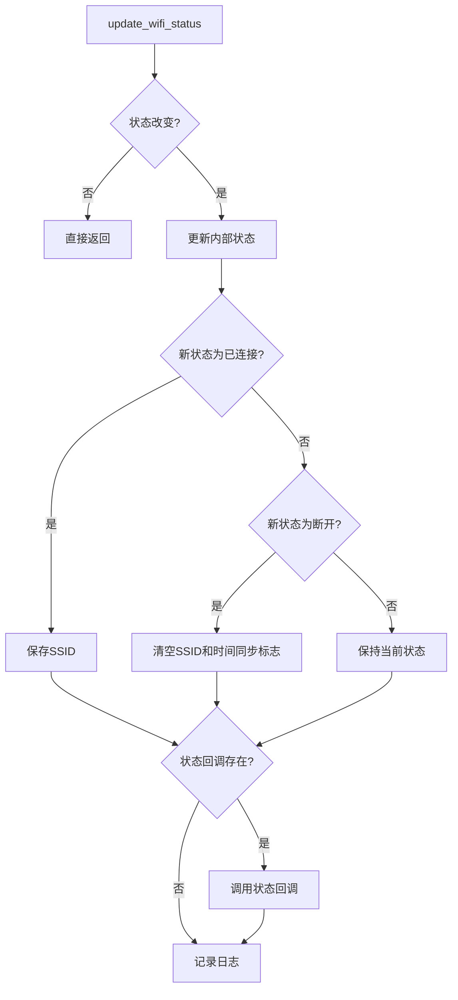

wifi manager模块执行流程。

文件位置：[wifi_manager.c](components\system\services\wifi_manager.c)

## WiFi管理器整体架构流程图

## WiFi连接流程图

## WiFi事件处理流程图

## SNTP时间同步流程图

## WiFi扫描流程图

## WiFi开关控制流程图

## 状态管理流程图

WiFi管理器实现了完整的WiFi连接管理功能，包括连接、断开、扫描、状态管理、时间同步和开关控制等核心功能。整个系统采用事件驱动的架构，通过FreeRTOS的事件组和信号量实现线程安全的操作。